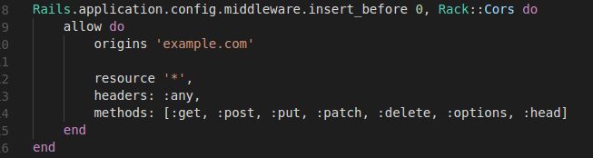
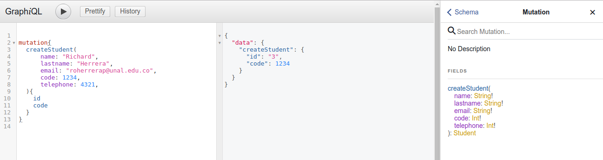
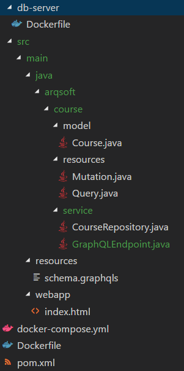
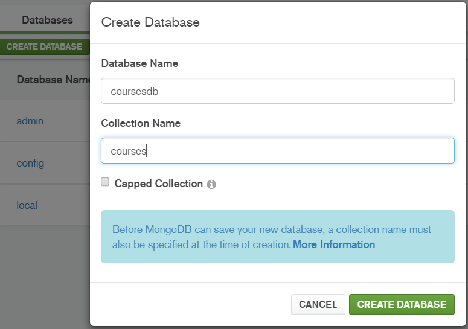
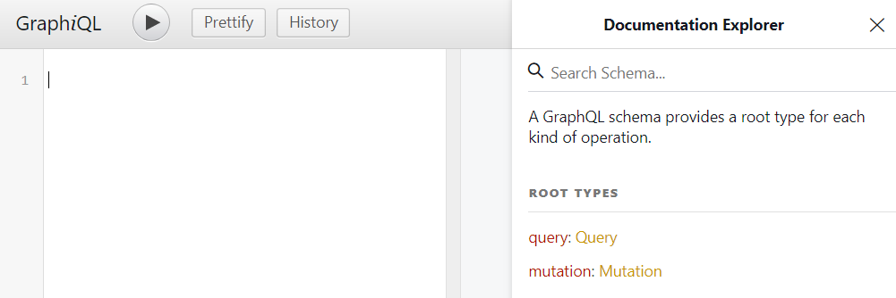
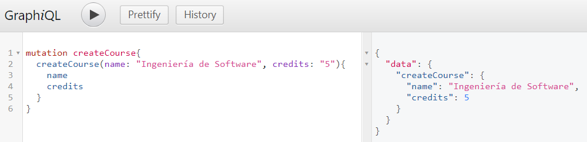
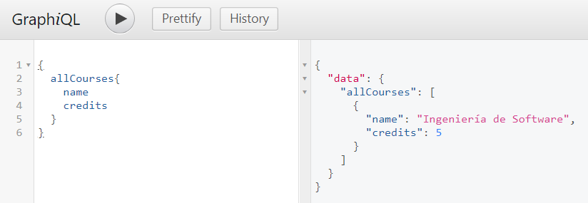

  

<h2 align="center"><small>Laboratory #1</small>  <big>Distributed Architectures, Part 1 </big></h2>

<h5 align="center">Jeisson Andrés Vergara Vargas <small>Software Architecture 2018-I</small></h5>

---

# Caso de Estudio:
El caso de estudio que se trabajará en la materia es sobre un Sistema de Información Académico (SIA), por lo tanto se establecieron inicialmente los siguientes microservicios y lenguajes de programación:
- Estudiantes (Ruby).
- Materias (Java).
- Notas por Materia (Ruby).

## Requisitos Iniciales

### Ruby on Rails (RoR)

  **a.** Instalar Ruby y RoR según el sistema operativo:

http://rubyonrails.org.es/instala.html

  **b.** Realizar el proceso de instalación, y verificar que se encuentren correctamente instalados usando los siguientes comandos:

> `ruby -v`

> `rails -v`

  

### Java

  **a.** Instalar Java JRE 1.8.0.25.

http://www.oracle.com/technetwork/java/javase/downloads/java-archive-javase8-2177648.html

  **b.** Verificar la versión instalada:

>`java -version`

   

  **c.** Descargar el conector de mysql para java, usar la version 5.1.34

https://downloads.mysql.com/archives/c-j/

### Aplicaciones
  **a.** Postman:

https://www.getpostman.com/

  **b.** Mysql Workbench:

https://www.mysql.com/products/workbench/

  **c.** Maven:

https://maven.apache.org/install.html

### Imágenes de Docker

Para descargar las imágenes de Docker recuerde que debe tener activado el nodo, el comando en consola para activar el nodo es:

> `eval $(docker-machine env NOMBRE_DEL_NODO)`

Ahora las imágenes de Docker que se utilizarán para el laboratorio son: 

  **a.** Mysql:

> `docker pull mysql`

  **b.** Glassfish:

> `docker pull glassfish`

  **c.** Ruby 2.3:

> `docker pull ruby:2.3`

## Creación de los Microservicios

### **a.** Microservicio "Students" en Ruby On Rails

**1.** Dirigirse a la carpeta donde se creará el microservicio e ingresar el comando:

> `rails new sa_students_ms -d mysql --api`

**2.** En la raíz del proyecto creado, ejecutar:

> `gem install mysql2`

**3.** Agregar las siguientes líneas en el Gemfile:

> `gem 'therubyracer', :platforms => :ruby`

> `gem 'execjs'`

**4.** Con el fin de instalar las gemas del proyecto, ejecutar el siguiente comando en la raíz del proyecto:

> `bundle install`

### Dockerización del Microservicio

**5.** Crear dos archivos en la raíz del proyecto:

* [Dockerfile](./files/Ruby/Dockerfile)

* [docker-compose.yml](./files/Ruby/docker-compose.yml)

**6.** Configurar el archivo **/config/database.yml**, poniendo el usuario y contraseña correspondientes, declarados en el archivo docker-compose.yml (en default: username, password; en development: database). Así mismo, agregar el host en default.

**7.** Ejecutar los siguientes comandos para desplegar el microservicio:

 >`docker-compose build  `

 >`docker-compose run --rm sa_students_ms rails db:create`  
	 
 >`docker-compose run --rm sa_students_ms rails db:migrate  `
	 
 >`docker-compose up `
	 `

**8.** Verificar el Servidor Rancher, allí se podrán visualizar los dos contenedores creados: uno para la base de datos y otro para el microservicio:

**9.** Verificar la dirección http://192.168.99.101:3000:

### Creación del API-REST del Microservicio

**10.** Realizar 'Ctrl + C' en la consola para salir.

**11.** El microservicio creado se encargará de los estudiantes, por lo tanto tendrá un modelo llamado Student, que tendrá los siguientes atributos:

* id: Integer
* name: String
* lastname: String
* email: String
* code: Integer
* telephone: Bigint

**12.** Para generar el modelo, ejecutar el siguiente comando:

>	` rails generate scaffold Student name:string lastname:string email:string code:integer telephone:bigint `

**13.** Se crearán los controladores necesarios para realizar las operaciones CRUD del modelo Student.

**14.** Desplegar nuevamente el microservicio usando los 4 comandos.

### Comprobación del API-REST

**15.** Operación Create Student. En Postman:

http://192.168.99.101:3000/students:

**Body:**  
> {  
	"name": "Camilo",  
  "lastname": "Dajer",  
  "email": "cadajerp@unal.edu.co",  
	"code": 28791234,  
	"telephone": 123456789  
}

**16.** Operación Get All Students. En Postman:   http://192.168.99.101:3000/students:

**17.** Operación Get Student By Id. En Postman: http://192.168.99.101:3000/students/1 (para id: 1):

### **b.** Microservicio "Courses" en Java
**18.** Crear la estructura para el microservicio:

**19.** En java se utilizará un modelo por capas, el código fuente se puede descargar del siguiente [enlace](./files/Java/sa_courses_ms.rar).

En la estructura del microservicio en Java debemos tener en cuenta lo siguiente:
* Entity: Es el modelo de la tabla o tablas que se encuentran en la base de datos, con sus atributos y métodos relacionados.
* Service: contiene los métodos CRUD sobre una tabla específica.
* Resource: contiene los métodos de la REST API que el usuario estableció, además cómo serán sentenciados en la url, el body (del mensaje), etc.

**20.** Los archivos necesarios para el funcionamiento con Docker son los siguientes:

**a.** ./db-server/Dockerfile: En este archivo indicaremos la imagen a utilizar para nuestro motor de base de datos, para este caso específico será "MySQL"; La sentencia "ENV" permitira hacer uso de las variables de entorno para esa imagen.

    From mysql

    ENV MYSQL_ROOT_PASSWORD 123
    ENV MYSQL_DATABASE courses
    ENV MYSQL_USER arqsoft
    ENV MYSQL_PASSWORD 123

**b.** ./Dockerfile: En este archivo se indicara la imagen del servidor de aplicaciones que ejecutará el código hecho en Java, para este caso se hace uso del servidor de aplicaciones "Glassfish", por lo tanto los siguientes comandos se encargarán de proporcionar todos los archivos necesarios para que el servidor ejecute la aplicación.

    FROM glassfish

    COPY db-server/mysql-connector-java-5.1.34.jar glassfish/lib/mysql-connector-java-5.1.34.jar
    COPY app-server/domain.xml glassfish/domains/domain1/config/domain.xml
    COPY app-server/admin-keyfile glassfish/domains/domain1/config/admin-keyfile
    COPY target/courses.war glassfish/domains/domain1/autodeploy/courses.war

**c.** ./docker-compose.yml: En este archivo se especifica la información adicional para la creación de los contenedores. 

    courses-db:
      build: ./db-server
      ports:
        - "3309:3306"
    courses-ms:
      build: .
      ports:
        - "4040:4040"
      links:
        - courses-db

**21.** Ejecutar el siguiente comando para verificar el codigo fuente y crear el archivo **war**:

>mvn -f pom.xml package

Se debe verficar que haya finalizado correctamente el proceso de compilación, en caso de no haber sido así, verificar y corregir los errores.

**22.** Tener encuenta que se debe tener seleccionado el nodo al cual se desplegara los contenedores.

**22.** Ejecutar el siguiente comando:

>docker-compose build

**23.** Ejecutar el siguiente comando:

>docker-compose up

**24.** Realizar las peticiones a través de "Postman" como en el caso del contenedor de estudiantes para verificar que las operaciones CRUD estén funcionando.  

http://192.168.99.101:4040/courses/resources/course

    {
        "name": "Software Architecture",
        "credits": 3
    }

