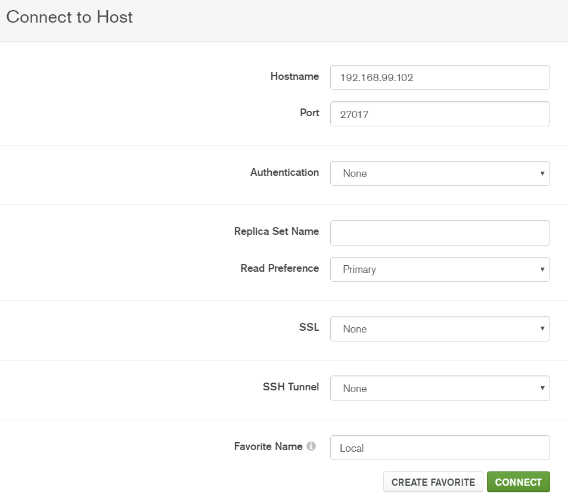

<p align="center">
  
</p>
<h2 align="center"><small>Laboratory #2</small></br> <big>Distributed Architectures, Part 2</big></h2>

<h5 align="center">Jeisson Andrés Vergara Vargas</br><small>Software Architecture</br>2018-I</small></h5>

---

# Pre-requisitos
Para la realización de este laboratorio es necesario tener los microservicios del caso de estudio realizados en el laboratorio #1, los cuales son:
- Students: sa_students_ms, puerto 3000.

El de courses tendrá un cambio de una base de datos relacional a un NoSQL (MongoDB) y un nuevo puerto de exposición:

Las nuevas imágenes para los contenedores de docker son:

>docker pull mongo

>docker pull jetty

- Courses: courses-ms, puerto 8080.

- Grades: grades-ms, puerto 5000
  * student_id: Integer
  * course_id: Integer
  * grade_value: float

- MongoDB Compass Comunity: herramienta GUI para MongoDB.
    https://docs.mongodb.com/compass/master/install/ 

# Graphql

Se procedera a la implementación de graphql en cada uno de los microservicios:

## sa_students_ms

### Queries

1. Agregar la siguiente gema al archivo **Gemfile** del microservicio de students:

         gem 'graphql', '1.7.4'
         gem 'graphiql-rails'
         gem 'sass-rails'
         gem 'uglifier'
         gem 'coffee-rails'

2. Ejecutar los siguientes comandos:

        bundle update
        rails generate graphql:install

3. Crear un nuevo archivo en **app/graphql/types/** llamado student_type.rb y agregue el siguiente contenido:


        Types::StudentType = GraphQL::ObjectType.define do

          name 'Student'

          field :id, !types.ID
          field :name, !types.String
          field :lastname, !types.String
          field :email, !types.String
          field :code, !types.Int
          field :telephone, !types.Int

        end

4. Modificar el archivo **app/graphql/types/** llamado query_type.rb por el siguiente contenido:

        Types::QueryType = GraphQL::ObjectType.define do
          name 'Query'

          # queries are just represented as fields
          field :allStudents, !types[Types::StudentType] do
            # resolve would be called in order to fetch data for that field
            resolve -> (obj, args, ctx) { Student.all }
          end
        end

5. Ingresar al archivo **config/application.rb** y descomentar la siguiente linea, en caso de no estar se debe agregar:

        require "sprockets/railtie"


6. Agregar la siguiente linea al archivo **config/routes.rb**

        mount GraphiQL::Rails::Engine, at: "/graphiql", graphql_path: "/graphql"

7. Desplegar la aplicación en el nodo correspondiente

8. Ingresar a la dirección http://192.168.99.101:3000/graphiql donde se podra observar el IDE de graphql para realizar pruebas de las peticiones.

9. Si se realizar clic en **Docs  > query** se podra observar los queries definidos anteriormente, donde se especifica los tipos de datos que posee el objeto para ser consultados:

        {
          allStudents{
            id
            name
            code
          }
        }


De esta manera se pueden especificar los atributos que son necesarios para una consulta determinada.

### Mutations

10. El proceso de crear una mutacion es parecido al de crear una consulta, para esto debemos revisar el archivo en la carpeta **app/graphql/type** llamado **mutation_type.rb**


        Types::StudentType = GraphQL::ObjectType.define do
          name 'Student'


          field :testField, types.String do
            description "An example field added by the generator"
            resolve ->(obj, args, ctx) {
              "Hello World!"
            }
          end
        end

11. La mutacion es agregada automaticamente al archivo **app/graphql/sa_students_ms_schema.rb**

        SaStudentsMsSchema = GraphQL::Schema.define do
          mutation(Types::MutationType)
          query(Types::QueryType)
        end


12. Crear un nuevo archivo en **app/graphql/resolvers/** llamado create_student.rb, si no existe la carpeta debe ser creada.


13. Agregar el siguiente codigo al archivo creado:

        class Resolvers::CreateStudent < GraphQL::Function

          argument :name, !types.String
          argument :lastname, !types.String
          argument :email, !types.String
          argument :code, !types.Int
          argument :telephone, !types.Int


          type Types::StudentType

          def call(_obj, args, _ctx)
            Student.create!(
              name: args[:name],
              lastname: args[:lastname],
              email: args[:email],
              code: args[:code],
              telephone: args[:telephone],
            )
          end
        end

14. Tambien se debe modificar el archivo **app/graphql/types/mutation_type.rb** de tal manera que quede de la siguiente forma:

        Types::MutationType = GraphQL::ObjectType.define do
          name 'Mutation'

          field :createStudent, function: Resolvers::CreateStudent.new
        end

15. Desplegar nuevamente el microservicio


16. Realizar la siguiente peticion en el IDE de la dirección 192.168.99.101:3000/graphiql

        mutation{
          createStudent(
              name: "Richard",
              lastname: "Herrera",
              email: "roherrerap@unal.edu.co",
              code: 1234,
              telephone: 4321,
          ){
            id
            code
          }
        }


## sa_courses_ms

El microservicio de cursos sufrirá un cambio en el servidos de bases de datos, utilizará ahora una base de datos documental llamada **MongoDB** y su puerto de exposición es el **27017**.

Estructura final del proyecto:


Se adjunta la nueva configuración de:

**a. ./db-server/Dockerfile:** 

    FROM mongo:latest
    CMD ["mongod", "--smallfiles"]

**b. .docker-compose.yml:** 

    courses-db:
      build: ./db-server
      ports:
        - 27017:27017
      hostname: mongodb

    courses-ms:
      build: .
      ports:
        - "8080:8080"
      links:
        - courses-db


**c. .Dockerfile:** 

    FROM jetty

    ADD target/courses.war /var/lib/jetty/webapps/root.war

    EXPOSE 8080

Se debe tener en cuenta que el archivo **pom.xml** tiene nuevas dependencias que ayudan para el uso de graphql.

La estructura base del proyecto se encuentra en este enlace. 

### Queries

La representación de Graphql types es el equivalente a la clase en Java. Primero debemos definir el esquema que tendrá para las solicitudes.

17. **./src/main/resources:** Se crea un archivo con el nombre **schema.graphqls**, y en este archivo se definen los modelos y las queries que se van a utilizar.


```
  type Course{
    id: ID!
    name: String!
    credits: Long!
  }

  type Query {
    allCourses: [Course]
  }

  type Mutation {
    createCourse(name: String!, credits: Long!): Course
  }

  schema {
    query: Query
    mutation: Mutation
  }
```

18. **./src/java/arqsoft/course/service:** Se crea un archivo con el nombre **CourseRepository.java**, cuya función es tener las funciones de consulta, almacenamiento, etc., de los cursos.

  ```
  package arqsoft.course.service;

  import arqsoft.course.model.Course;
  import com.mongodb.client.MongoCollection;

  import org.bson.Document;
  import org.bson.types.ObjectId;
  import static com.mongodb.client.model.Filters.eq;

  import java.util.List;
  import java.util.ArrayList;


  public class CourseRepository {

      private final MongoCollection<Document> courses;

      public CourseRepository(MongoCollection<Document> courses) {
          this.courses = courses;
      }

      public Course findById(String id) {
          Document doc = courses.find(eq("_id", new ObjectId(id))).first();
          return course(doc);
      }

      public List<Course> getAllCourses() {
          List<Course> allCourses = new ArrayList<>();
          for (Document doc : courses.find()) {
              allCourses.add(course(doc));
          }
          return allCourses;
      }

      public void saveCourse(Course course) {
          Document doc = new Document();
          doc.append("name", course.getName());
          doc.append("credits", course.getCredits());
          courses.insertOne(doc);
      }

      private Course course(Document doc) {
          return new Course(
                  doc.get("_id").toString(),
                  doc.getString("name"),
                  doc.getString("credits"));
      }
  }
  ```

19. **./src/main/java/arqsoft/course/resources:** Se deben crear dos archivos el **Query.java** y el **Mutation.java**, son los encargados de resolver las queries establecidas en el esquema de graphql creado anteriormente.

    **a. Query.java:**

        package arqsoft.course.resources;

        import arqsoft.course.model.Course;
        import arqsoft.course.service.CourseRepository;

        import com.coxautodev.graphql.tools.GraphQLRootResolver;
        import java.util.List;

        public class Query implements GraphQLRootResolver{
          private final CourseRepository courseRepository;

          public Query(CourseRepository courseRepository){
            this.courseRepository = courseRepository;
          }

          public List<Course> allCourses(){
            return courseRepository.getAllCourses();
          }
        }

    **b. Mutation.java:**

        package arqsoft.course.resources;

        import arqsoft.course.model.Course;
        import arqsoft.course.service.CourseRepository;
        import com.coxautodev.graphql.tools.GraphQLRootResolver;
        import java.time.Instant;
        import java.time.ZoneOffset;
        import graphql.GraphQLException;
        import graphql.schema.DataFetchingEnvironment;

        public class Mutation implements GraphQLRootResolver {

          private final CourseRepository courseRepository;

          public Mutation(CourseRepository courseRepository){
            this.courseRepository = courseRepository;
          }

          public Course createCourse(String name, String credits){
            Course newCourse = new Course(name, credits);
            courseRepository.saveCourse(newCourse);
            return newCourse;
          }
        }

20. **./src/main/java/arqsoft/course/service:** Se crea un archivo con el nombre **GraphqQLEndpoint.java**, se encarga de resolver las propiedades cuando se está generando el esquema de graphql. Se debe tener la exposición del servicio para que pueda ser consumido por otras API's, además se sentencia la conexión a la base de datos NoSQL y todos los esquemas que se establecieron.

        package arqsoft.course.service;

        import com.coxautodev.graphql.tools.SchemaParser;
        import javax.servlet.annotation.WebServlet;
        import graphql.servlet.SimpleGraphQLServlet;
        import graphql.schema.GraphQLSchema;
        import com.coxautodev.graphql.tools.SchemaParser;
        import com.mongodb.MongoClient;
        import com.mongodb.client.MongoDatabase;
        import arqsoft.course.resources.Query;
        import arqsoft.course.resources.Mutation;

        @WebServlet(urlPatterns = "/graphql")
        public class GraphQLEndpoint extends SimpleGraphQLServlet {

          private static final long serialVersionUID = 1L;
          private static final CourseRepository courseRepository;

          static {
            MongoDatabase mongo = new MongoClient("mongodb", 27017).getDatabase("coursesdb");
            courseRepository = new CourseRepository(mongo.getCollection("courses"));
          }

          public GraphQLEndpoint(){
            super(buildSchema());
          }

          private static GraphQLSchema buildSchema() {
            return SchemaParser.newParser()
              .file("schema.graphqls")
              .resolvers(new Query(courseRepository), new Mutation(courseRepository))
              .build()
              .makeExecutableSchema();
          }
        }

Ya una vez teniendo todas las clases creadas para el funcionamiento del microservicio, necesitamos de una herramienta para hacer las pruebas grapqql ofrece una herramienta gráfica para realizar consultas, peticiones, etc., en el caso de java bajo la carpeta de **webapp** hay un archivo html que nos falicitará las consultas de las queries establecidas.

21. Desplegar el microservicio de cursos en java, recuerde que debe primero compilarse con la sentencia mvn y tener el nodo seleccionado.

22. Debido a que es la primera vez que se inicia el servidor de la base de datos, utilizar la herramienta MongoDB Compass, para crear/consultar la base de datos y conexión al microservicio.

      **a. Conexión al microservicio:** Se debe colocar en el campo de hostname la dirección ip del microservicio y el puerto de exposición del mismo.

      

      **b. Crear la base de datos:** Se debe crear la base de datos tal y como se especificó en la clase **GraphQLEndpoint.java**, en este caso es **coursesdb** y la colección de los documentos es **courses**.

      
  
23. Ya con las preparaciones listas, se probará el microservicio, acceder a la dirección del nodo con el puerto **8080**, en este caso es: **192.168.99.102:8080**. 

      

24. Al igual que lo realizado en el microservicio de estudiantes, se realizarán consulta y creación.

      **a. Crear:**

          mutation createCourse{
            createCourse(name: "Ingeniería de Software", credits: "5"){
              name
              credits
            }
          }

      

      **b. Consultar:**

        {
          allCourses{
            name
            credits
          }
        }

      
