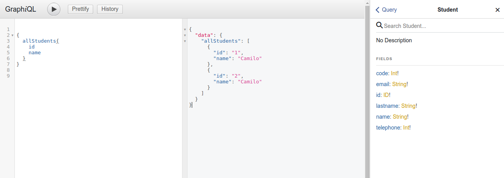

  

<h2 align="center"><small>Laboratory #2</small>  <big>Distributed Architectures, Part 2</big></h2>

<h5 align="center">Jeisson Andrés Vergara Vargas <small>Software Architecture 2018-I</small></h5>

---

# Pre-requisitos
Para la realización de este laboratorio es necesario tener los microservicios del caso de estudio realizados en el laboratorio #1, los cuales son:
- Students: sa_students_ms, puerto 3000.
- Courses: courses-ms, puerto 4040.

- Grades: grades-ms, puerto 5000
  * student_id: Integer
  * course_id: Integer
  * grade_value: float

# Creación del API Gateway

1. Dirigirse a la carpeta donde se creará el API Gateway, e ingresar el comando:

> ` rails new sa_api_gateway --api `

2. Agregar las siguientes líneas en el Gemfile:

> ` gem 'httparty' `  
> ` gem 'rack-cors' `   
> ` gem 'graphql' `
> ` gem 'graphiql-rails' `

3. Ejecutar el siguiente comando en la raíz del proyecto:

> ` gem install httparty `

4. Con el fin de instalar las gemas del proyecto, ejecutar el siguiente comando en la raíz del proyecto:

>  `bundle install `

5. Ejecutar el siguiente comando en la raíz del proyecto:

> ` rails generate graphql:install `

6. Modificar el archivo config/initializers/cors.rb (descomentar las líneas respectivas):

# Dockerización del API Gateway

7. Crear los archivos Dockerfile, y docker-compose.yml. Desplegar el API Gateway en el puerto 6000 (recordar que este componente no hace uso de una base de datos):

* Dockerfile

      FROM ruby:2.3 `  
      RUN mkdir /sa_api_gateway_ms 
      WORKDIR /sa_api_gateway_ms 
      ADD Gemfile /sa_api_gateway_ms/Gemfile`   
      ADD Gemfile.lock /sa_api_gateway_ms/Gemfile.lock   
      RUN bundle install   
      ADD . /sa_api_gateway_ms 

* docker-compose.yml

      version: '2'
      services:
        sa_api_gateway_ms:
          build: .
          command: bash -c "sleep 40 && rm -f tmp/pids/server.pid && bundle exec rails db:migrate && bundle exec rails s -p 6000 -b '0.0.0.0'"
          ports:
            - "6000:6000"

# Peticiones Post

8. Crear un controlador llamado assign, mediante el comando:

> ` rails generate controller assign `

Este controlador permitirá manejar la lógica necesaria para realizar una asignación de nota, para la cual se deberá hacer uso de los 3 microservicios: sa_students_ms, sa_courses_ms, sa_grades_ms.

9. Agregar los siguientes tres métodos en assign_controller.rb:

* La gema Httparty permite realizar peticiones Get y Post al endpoint especificado, con o sin opciones. En este caso en específico se crean dos métodos, en el cual cada uno realiza una petición a un microservicio (Students y Courses). Una vez realizan la petición, retorna el resultado, el cual será verificado en busca de saber si tanto el usuario como el producto existen en sus respectivos microservicios. Una vez se confirme su existencia, se creará un registro en el microservicio Grades, almacenando la nota correspondiente.

10. Recordar que se deben configurar los endpoints dependiendo de las configuraciones realizadas en el Laboratorio #1.

11. Agregar la siguiente línea en el archivo de rutas (config/routes.rb), de esta manera se configurará el endpoint del método sale: 

> ` post '/assign', to: 'assign#assign' ` 

12. Desplegar el API Gateway 

        def assign

            @student = params[:student]
            @course = params[:course]
            @grade = params[:grade]
      
            result_student = checkStudent(@student)
            result_course = checkCourse(@course)
      
            puts result_student
            puts result_course

            if result_student.include? "name" and result_course.include? "name"
      
              options = {
                :body =>
              {
                  :student_id => @student,
                  :course_id => @course,
                  :grade_value => @grade
                }.to_json,
      
                :headers => { 'Content-Type' => 'application/json' }
              }
      
              results = HTTParty.post("http://192.168.99.101:5000/grades", options )
      
            end
      
          end
      
          def checkStudent(id)
      
            results = HTTParty.get("http://192.168.99.101:3000/students/" + id.to_s )
            return results
          end
      
          def checkCourse(id)
      
            results = HTTParty.get("http://192.168.99.101:4040/courses/resources/course/" + id.to_s )
            return results
      
          end

          private
    
    
          # Only allow a trusted parameter "white list" through.
          def assign_params
            params.permit(:student, :course, :grade)
          end

13. Hacer la siguiente petición al Api Gateway:

http://192.168.99.102:6000/assign

      {
        "student": 1,
        "course": 1,
        "grade": 5
      }

14. Consultar el microservicio de grades y verificiar que la petición fue guardada exitosamente.

# Graphql

8. Agregar las siguientes lineas al archivos de config/routes.rb 

        post '/gradesbystudent', to: 'graphql#query'
        if Rails.env.development?
          mount GraphiQL::Rails::Engine, at: "/gradesbystudent", graphql_path: "/graphql"
        end